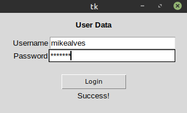
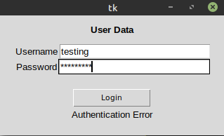

## How to use this App:
---
From your terminal, navigate to this folder and then type:

```
python3 application.py
```

You can test the application by typing the following Username:

```
mikealves
```
and the following Password:

```
testing
```

After clicking on "Login" you will get a "Success!" message showing that the login was successfull.




---

As this program does to store any data, you'll recieve an "Authentication Error" if you try to use any other Username/Password combination.



